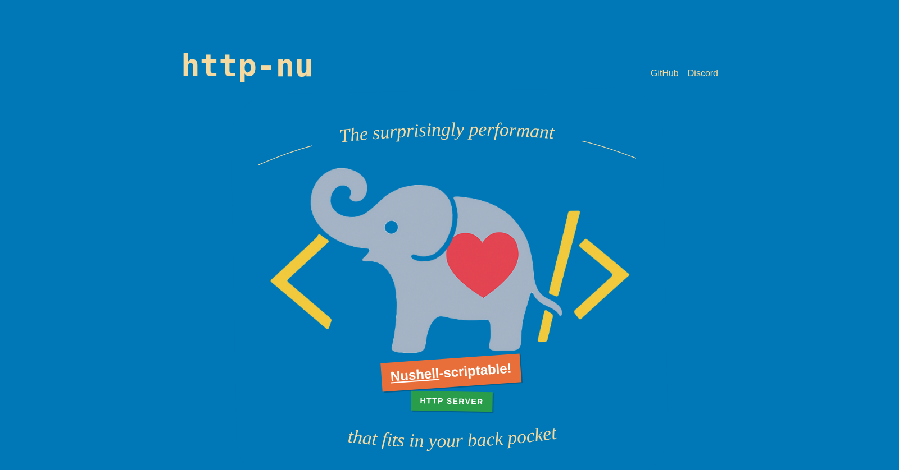

<!-- LOGO -->
<h1>
<p align="center">
  <a href="https://http-nu.cross.stream">
    
  </a>
  <br><br>
  http-nu
</h1>
  <p align="center">
    The surprisingly performant, <a href="https://www.nushell.sh">Nushell</a>-scriptable, <a href="https://cross.stream">cross.stream</a>-powered, <a href="https://data-star.dev">Datastar</a>-ready HTTP server that fits in your back pocket.
    <br />
    <a href="#install">Install</a>
    ·
    <a href="#reference">Reference</a>
    ·
    <a href="https://discord.com/invite/YNbScHBHrh">Discord</a>
  </p>
</p>

<p align="center">
  <a href="https://github.com/cablehead/http-nu/actions/workflows/ci.yml">
    
  </a>
  <a href="https://discord.com/invite/YNbScHBHrh">
    
  </a>
  <a href="https://crates.io/crates/http-nu">
    
  </a>
</p>

---

<!-- BEGIN mktoc -->

- [Install](#install)
  - [eget](#eget)
  - [Homebrew](#homebrew-macos)
  - [cargo](#cargo)
  - [Nix](#nix)
- [Reference](#reference)
  - [GET: Hello world](#get-hello-world)
  - [UNIX domain sockets](#unix-domain-sockets)
  - [Watch Mode](#watch-mode)
  - [Reading from stdin](#reading-from-stdin)
  - [POST: echo](#post-echo)
  - [Request metadata](#request-metadata)
  - [Response metadata](#response-metadata)
  - [Content-Type Inference](#content-type-inference)
  - [TLS & HTTP/2 Support](#tls-support)
  - [Logging](#logging)
  - [Trusted Proxies](#trusted-proxies)
  - [Serving Static Files](#serving-static-files)
  - [Streaming responses](#streaming-responses)
  - [server-sent events](#server-sent-events)
  - [Embedded Store](#embedded-store)
  - [Reverse Proxy](#reverse-proxy)
  - [Templates](#templates)
    - [`.mj` - Render inline](#mj---render-inline)
    - [`.mj compile` / `.mj render` - Precompiled templates](#mj-compile--mj-render---precompiled-templates)
  - [Syntax Highlighting](#syntax-highlighting)
  - [Markdown](#markdown)
  - [Streaming Input](#streaming-input)
  - [Plugins](#plugins)
  - [Module Paths](#module-paths)
  - [Embedded Modules](#embedded-modules)
    - [Routing](#routing)
    - [HTML DSL](#html-dsl)
    - [Datastar SDK](#datastar-sdk)
- [Eval Subcommand](#eval-subcommand)
- [Building and Releases](#building-and-releases)
  - [Available Build Targets](#available-build-targets)
  - [Examples](#examples)
  - [GitHub Releases](#github-releases)
- [History](#history)

<!-- END mktoc -->

## Install

### [eget](https://github.com/zyedidia/eget)

```bash
eget cablehead/http-nu
```

### Homebrew (macOS)

```bash
brew install cablehead/tap/http-nu
```

### cargo

For fast installation using pre-built binaries:

```bash
cargo binstall http-nu
```

Or build from source:

```bash
cargo install http-nu --locked
```

### Nix

```bash
nix-shell -p http-nu
```

http-nu is available in [nixpkgs](https://github.com/NixOS/nixpkgs). For
packaging and maintenance documentation, see
[NIXOS_PACKAGING_GUIDE.md](NIXOS_PACKAGING_GUIDE.md).

## Reference

### GET: Hello world

```bash
$ http-nu :3001 -c '{|req| "Hello world"}'
$ curl -s localhost:3001
Hello world
```

Or from a file:

```bash
$ http-nu :3001 ./serve.nu
```

Check out the [`examples/basic.nu`](examples/basic.nu) file in the repository
for a complete example that implements a mini web server with multiple routes,
form handling, and streaming responses.

### UNIX domain sockets

```bash
$ http-nu ./sock -c '{|req| "Hello world"}'
$ curl -s --unix-socket ./sock localhost
Hello world
```

### Watch Mode

Use `-w` / `--watch` to automatically reload when files change:

```bash
$ http-nu :3001 -w ./serve.nu
```

This watches the script's directory for any changes (including included files)
and hot-reloads the handler. Useful during development. Active
[SSE connections](#server-sent-events) are aborted on reload to trigger client
reconnection.

### Reading from stdin

Pass `-` to read the script from stdin:

```bash
$ echo '{|req| "hello"}' | http-nu :3001 -
```

With `-w`, send null-terminated scripts to hot-reload the handler:

```bash
$ (printf '{|req| "v1"}\0'; sleep 5; printf '{|req| "v2"}') | http-nu :3001 - -w
```

Each `\0`-terminated script replaces the handler.

### POST: echo

```bash
$ http-nu :3001 -c '{|req| $in}'
$ curl -s -d Hai localhost:3001
Hai
```

### Request metadata

The Request metadata is passed as an argument to the closure.

```bash
$ http-nu :3001 -c '{|req| $req}'
$ curl -s 'localhost:3001/segment?foo=bar&abc=123' # or
$ http get 'http://localhost:3001/segment?foo=bar&abc=123'
─────────────┬───────────────────────────────
 proto       │ HTTP/1.1
 method      │ GET
 uri         │ /segment?foo=bar&abc=123
 path        │ /segment
 remote_ip   │ 127.0.0.1
 remote_port │ 52007
 trusted_ip  │ 127.0.0.1
             │ ────────────┬────────────────
 headers     │  host       │ localhost:3001
             │  user-agent │ curl/8.7.1
             │  accept     │ */*
             │ ────────────┴────────────────
             │ ─────┬─────
 query       │  abc │ 123
             │  foo │ bar
             │ ─────┴─────
─────────────┴───────────────────────────────

$ http-nu :3001 -c '{|req| $"hello: ($req.path)"}'
$ http get 'http://localhost:3001/yello'
hello: /yello
```

### Response metadata

Set HTTP response status and headers using nushell's pipeline metadata:

```nushell
"body" | metadata set --merge {'http.response': {
  status: <number>  # Optional, defaults to 204 if body is empty, 200 otherwise
  headers: {        # Optional, HTTP headers
    <key>: <value>  # Single value: "text/plain"
    <key>: [<value>, <value>]  # Multiple values: ["cookie1=a", "cookie2=b"]
  }
}}
```

Header values can be strings or lists of strings. Multiple values (e.g.,
Set-Cookie) are sent as separate HTTP headers per RFC 6265.

```
$ http-nu :3001 -c '{|req| "sorry, eh" | metadata set --merge {"http.response": {status: 404}}}'
$ curl -si localhost:3001
HTTP/1.1 404 Not Found
transfer-encoding: chunked
date: Fri, 31 Jan 2025 08:20:28 GMT

sorry, eh
```

Multi-value headers:

```nushell
"cookies set" | metadata set --merge {'http.response': {
  headers: {
    "Set-Cookie": ["session=abc; Path=/", "token=xyz; Secure"]
  }
}}
```

### Content-Type Inference

Content-type is determined in the following order of precedence:

1. Headers set via `http.response` metadata:
   ```nushell
   "body" | metadata set --merge {'http.response': {
     headers: {"Content-Type": "text/plain"}
   }}
   ```

2. Pipeline metadata content-type (e.g., from `to yaml` or
   `metadata set --content-type`)

3. Inferred from value type:
   - Record -> `application/json`
   - List -> `application/json` (JSON array)
   - Stream of records -> `application/x-ndjson` (JSONL)
   - Binary or byte stream -> `application/octet-stream`
   - Empty (null) -> no Content-Type header

4. Default: `text/html; charset=utf-8`

Examples:

```nushell
# 1. Explicit header takes precedence
{|req| {foo: "bar"} | metadata set --merge {'http.response': {headers: {"Content-Type": "text/plain"}}} }

# 2. Pipeline metadata
{|req| ls | to yaml }  # Returns as application/x-yaml

# 3. Inferred from value type
{|req| {foo: "bar"} }                 # Record -> application/json
{|req| [{a: 1}, {b: 2}, {c: 3}] }     # List -> application/json (array)
{|req| 1..10 | each { {n: $in} } }    # Stream of records -> application/x-ndjson
{|req| 0x[deadbeef] }                 # Binary -> application/octet-stream
{|req| null }                         # Empty -> no Content-Type header

# 4. Default
{|req| "Hello" }  # Returns as text/html; charset=utf-8
```

To consume a JSONL endpoint from Nushell:

```nushell
http get http://localhost:3001 | from json --objects | each {|row| ... }
```

### TLS Support

Enable TLS by providing a PEM file containing both certificate and private key:

```bash
$ http-nu :3001 --tls combined.pem -c '{|req| "Secure Hello"}'
$ curl -k https://localhost:3001
Secure Hello
```

Generate a self-signed certificate for testing:

```bash
$ openssl req -x509 -newkey rsa:4096 -keyout key.pem -out cert.pem -days 365 -nodes
$ cat cert.pem key.pem > combined.pem
```

HTTP/2 is automatically enabled for TLS connections:

```bash
$ curl -k --http2 -si https://localhost:3001 | head -1
HTTP/2 200
```

### Logging

Control log output with `--log-format`:

- `human` (default): Live-updating terminal output with startup banner,
  per-request progress lines showing timestamp, IP, method, path, status,
  timing, and bytes
- `jsonl`: Structured JSON lines with `scru128` stamps for log aggregation

Each request emits 3 phases: **request** (received), **response** (headers
sent), **complete** (body finished).

**Human format**


**JSONL format**

Events share a `request_id` for correlation:

```bash
$ http-nu --log-format jsonl :3001 '{|req| "hello"}'
{"stamp":"...","message":"started","address":"http://127.0.0.1:3001","startup_ms":42}
{"stamp":"...","message":"request","request_id":"...","method":"GET","path":"/","request":{...}}
{"stamp":"...","message":"response","request_id":"...","status":200,"headers":{...},"latency_ms":1}
{"stamp":"...","message":"complete","request_id":"...","bytes":5,"duration_ms":2}
```

Lifecycle events: `started`, `reloaded`, `stopping`, `stopped`, `stop_timed_out`

The `print` command outputs to the logging system (appears as `message: "print"`
in JSONL).

### Trusted Proxies

When behind a reverse proxy, use `--trust-proxy` to extract client IP from
`X-Forwarded-For`. Accepts CIDR notation, repeatable:

```bash
$ http-nu --trust-proxy 10.0.0.0/8 --trust-proxy 192.168.0.0/16 :3001 '{|req| $req.trusted_ip}'
```

The `trusted_ip` field is resolved by parsing `X-Forwarded-For` right-to-left,
stopping at the first IP not in a trusted range. Falls back to `remote_ip` when:

- No `--trust-proxy` flags provided
- Remote IP is not in trusted ranges
- No `X-Forwarded-For` header present

### Serving Static Files

You can serve static files from a directory using the `.static` command. This
command takes two arguments: the root directory path and the request path.

When you call `.static`, it sets the response to serve the specified file, and
any subsequent output in the closure will be ignored. The content type is
automatically inferred based on the file extension (e.g., `text/css` for `.css`
files).

Here's an example:

```bash
$ http-nu :3001 -c '{|req| .static "/path/to/static/dir" $req.path}'
```

For single page applications you can provide a fallback file:

```bash
$ http-nu :3001 -c '{|req| .static "/path/to/static/dir" $req.path --fallback "index.html"}'
```

### Streaming responses

Values returned by streaming pipelines (like `generate`) are sent to the client
immediately as HTTP chunks. This allows real-time data transmission without
waiting for the entire response to be ready.

```bash
$ http-nu :3001 -c '{|req|
  generate {|_|
    sleep 1sec
    {out: (date now | to text | $in + "\n") next: true }
  } true
}'
$ curl -s localhost:3001
Fri, 31 Jan 2025 03:47:59 -0500 (now)
Fri, 31 Jan 2025 03:48:00 -0500 (now)
Fri, 31 Jan 2025 03:48:01 -0500 (now)
Fri, 31 Jan 2025 03:48:02 -0500 (now)
Fri, 31 Jan 2025 03:48:03 -0500 (now)
...
```

### [server-sent events](https://developer.mozilla.org/en-US/docs/Web/API/Server-sent_events/Using_server-sent_events)

Use the `to sse` command to format records for the `text/event-stream` protocol.
Each input record may contain the optional fields `data`, `id`, `event`, and
`retry` which will be emitted in the resulting stream.

#### `to sse`

Converts `{data? id? event? retry?}` records into SSE format. Non-string `data`
values are serialized to JSON.

Auto-sets response headers: `content-type: text/event-stream`,
`cache-control: no-cache`, `connection: keep-alive`.

| input  | output |
| ------ | ------ |
| record | string |

Examples

```bash
> {data: 'hello'} | to sse
data: hello

> {id: 1 event: greet data: 'hi'} | to sse
id: 1
event: greet
data: hi

> {data: "foo\nbar"} | to sse
data: foo
data: bar

> {data: [1 2 3]} | to sse
data: [1,2,3]
```

```bash
# Note: `to sse` automatically sets content-type: text/event-stream
$ http-nu :3001 -c '{|req|
  tail -F source.json | lines | from json | to sse
}'

# simulate generating events in a seperate process
$ loop {
  {date: (date now)} | to json -r | $in + "\n" | save -a source.json
  sleep 1sec
}

$ curl -si localhost:3001/
HTTP/1.1 200 OK
content-type: text/event-stream
transfer-encoding: chunked
date: Fri, 31 Jan 2025 09:01:20 GMT

data: {"date":"2025-01-31 04:01:23.371514 -05:00"}

data: {"date":"2025-01-31 04:01:24.376864 -05:00"}

data: {"date":"2025-01-31 04:01:25.382756 -05:00"}

data: {"date":"2025-01-31 04:01:26.385418 -05:00"}

data: {"date":"2025-01-31 04:01:27.387723 -05:00"}

data: {"date":"2025-01-31 04:01:28.390407 -05:00"}
...
```

### Embedded Store

Embed [cross.stream](https://www.cross.stream) for real-time state and event
streaming. Append-only frames, automatic indexing, content-addressed storage.
Enable with `--store <path>`. Add `--services` to enable xs actors, services,
and actions - external clients can register automation via the store's API
(e.g., `xs append ./store echo.register ...`).

```bash
$ http-nu :3001 --store ./store ./serve.nu
```

Use `--topic <name>` to load the handler closure from a store topic instead of a
script file. With `-w`, the server live-reloads whenever the topic is updated:

```nushell
$ http-nu :3001 --store ./store --topic serve -w
# In another terminal:
$ '{|req| "hello, world"}' | xs append ./store/sock serve
```

If the topic doesn't exist yet, the server shows a placeholder page with
instructions until a handler is appended.

**Commands available in handlers:**

| Command   | Description                                     |
| --------- | ----------------------------------------------- |
| `.cat`    | Read frames (`-f` follow, `-n` new, `-T` topic) |
| `.last`   | Get latest frame for topic (`--follow` stream)  |
| `.append` | Write frame to topic (`--meta` for metadata)    |
| `.get`    | Retrieve frame by ID                            |
| `.remove` | Remove frame by ID                              |
| `.cas`    | Content-addressable storage operations          |
| `.id`     | Generate/unpack/pack SCRU128 IDs                |

**SSE with store:**

```nushell
{|req|
  .last quotes --follow
  | each {|frame| $frame.meta | to datastar-patch-elements }
  | to sse
}
```

See the [xs documentation](https://www.cross.stream) to learn more.

### Reverse Proxy

You can proxy HTTP requests to backend servers using the `.reverse-proxy`
command. This command takes a target URL and an optional configuration record.

When you call `.reverse-proxy`, it forwards the incoming request to the
specified backend server and returns the response. Any subsequent output in the
closure will be ignored.

**What gets forwarded:**

- HTTP method (GET, POST, PUT, etc.)
- Request path and query parameters
- All request headers (with Host header handling based on `preserve_host`)
- Request body (whatever you pipe into the command)

**Host header behavior:**

- By default: Preserves the original client's Host header
  (`preserve_host: true`)
- With `preserve_host: false`: Sets Host header to match the target backend
  hostname

#### Basic Usage

```bash
# Simple proxy to backend server
$ http-nu :3001 -c '{|req| .reverse-proxy "http://localhost:8080"}'
```

#### Configuration Options

The optional second parameter allows you to customize the proxy behavior:

```nushell
.reverse-proxy <target_url> {
  headers?: {<key>: <value>}     # Additional headers to add
  preserve_host?: bool           # Keep original Host header (default: true)
  strip_prefix?: string          # Remove path prefix before forwarding
  query?: {<key>: <value>}       # Replace query parameters (Nu record)
}
```

#### Examples

**Add custom headers:**

```bash
$ http-nu :3001 -c '{|req|
  .reverse-proxy "http://api.example.com" {
    headers: {
      "X-API-Key": "secret123"
      "X-Forwarded-Proto": "https"
    }
  }
}'
```

**API gateway with path stripping:**

```bash
$ http-nu :3001 -c '{|req|
  .reverse-proxy "http://localhost:8080" {
    strip_prefix: "/api/v1"
  }
}'
# Request to /api/v1/users becomes /users at the backend
```

**Forward original request body:**

```bash
$ http-nu :3001 -c '{|req| .reverse-proxy "http://backend:8080"}'
# If .reverse-proxy is first in closure, original body is forwarded (implicit $in)
```

**Override request body:**

```bash
$ http-nu :3001 -c '{|req| "custom body" | .reverse-proxy "http://backend:8080"}'
# Whatever you pipe into .reverse-proxy becomes the request body
```

**Modify query parameters:**

```bash
$ http-nu :3001 -c '{|req|
  .reverse-proxy "http://backend:8080" {
    query: ($req.query | upsert "context-id" "smidgeons" | reject "debug")
  }
}'
# Force context-id=smidgeons, remove debug param, preserve others
```

### Templates

Render [minijinja](https://github.com/mitsuhiko/minijinja) (Jinja2-compatible)
templates. Pipe a record as context.

#### `.mj` - Render inline

```bash
$ http-nu :3001 -c '{|req| {name: "world"} | .mj --inline "Hello {{ name }}!"}'
$ curl -s localhost:3001
Hello world!
```

From a file:

```bash
$ http-nu :3001 -c '{|req| $req.query | .mj "templates/page.html"}'
```

File-based templates support ``, ``, and
``. Referenced templates resolve from the template's directory and
subdirectories only - no parent traversal (`../`) or absolute paths.

#### `.mj compile` / `.mj render` - Precompiled templates

Compile once, render many. Syntax errors caught at compile time.

```nushell
let tpl = (.mj compile --inline "{{ name }} is {{ age }}")

# Or from file
let tpl = (.mj compile "templates/user.html")

# Render with data
{name: "Alice", age: 30} | .mj render $tpl
```

Useful for repeated rendering:

```nushell
let tpl = (.mj compile --inline "{{ i }}")
[{items: [1,2,3]}, {items: [4,5,6]}] | each { .mj render $tpl }
```

Compile once at handler load, render per-request:

```nushell
let page = .mj compile "templates/page.html"

{|req| $req.query | .mj render $page}
```

With HTML DSL (accepts `{__html}` records directly):

```nushell
use http-nu/html *
let tpl = .mj compile --inline (UL (_for {item: items} (LI (_var "item"))))
{items: [a b c]} | .mj render $tpl
# <ul><li>a</li><li>b</li><li>c</li></ul>
```

### Syntax Highlighting

Highlight code to HTML with CSS classes.

```bash
$ http-nu eval -c 'use http-nu/html *; PRE { "fn main() {}" | .highlight rust } | get __html'
<pre><span class="source rust">...

$ .highlight lang           # list languages
$ .highlight theme          # list themes
$ .highlight theme Dracula  # get CSS
```

### Markdown

Convert Markdown to HTML with syntax-highlighted code blocks.

```bash
$ http-nu eval -c '"# Hello **world**" | .md | get __html'
<h1>Hello <strong>world</strong></h1>
```

Code blocks use `.highlight` internally:

````bash
$ http-nu eval -c '"```rust
fn main() {}
```" | .md | get __html'
<pre><code class="language-rust"><span class="source rust">...
````

### Streaming Input

In Nushell, input only streams when received implicitly. Referencing `$in`
collects the entire input into memory.

```nushell
# Streams: command receives input implicitly
{|req| from json }

# Buffers: $in collects before piping
{|req| $in | from json }
```

For routing, `dispatch` must be first in the closure to receive the body. In
handlers, put body-consuming commands first:

```nushell
{|req|
  dispatch $req [
    (route {method: "POST"} {|req ctx|
      from json  # receives body implicitly
    })
  ]
}
```

### Plugins

Load Nushell plugins to extend available commands.

```bash
$ http-nu --plugin ~/.cargo/bin/nu_plugin_inc :3001 '{|req| 5 | inc}'
$ curl -s localhost:3001
6
```

Multiple plugins:

```bash
$ http-nu --plugin ~/.cargo/bin/nu_plugin_inc --plugin ~/.cargo/bin/nu_plugin_query :3001 '{|req| ...}'
```

Works with eval:

```bash
$ http-nu --plugin ~/.cargo/bin/nu_plugin_inc eval -c '1 | inc'
2
```

### Module Paths

Make module paths available with `-I` / `--include-path`:

```bash
$ http-nu -I ./lib -I ./vendor :3001 '{|req| use mymod.nu; ...}'
```

### Embedded Modules

#### Routing

http-nu includes an embedded routing module for declarative request handling.
The request body is available to handlers as `$in`.

```nushell
use http-nu/router *

{|req|
  dispatch $req [
    # Exact path match
    (route {path: "/health"} {|req ctx| "OK"})

    # Method + path
    (route {method: "POST", path: "/users"} {|req ctx|
      "Created" | metadata set --merge {'http.response': {status: 201}}
    })

    # Path parameters
    (route {path-matches: "/users/:id"} {|req ctx|
      $"User: ($ctx.id)"
    })

    # Header matching
    (route {has-header: {accept: "application/json"}} {|req ctx|
      {status: "ok"}
    })

    # Fallback (always matches)
    (route true {|req ctx|
      "Not Found" | metadata set --merge {'http.response': {status: 404}}
    })
  ]
}
```

Routes match in order. First match wins. Closure tests return a record (match,
context passed to handler) or null (no match). If no routes match, returns
`501 Not Implemented`.

#### HTML DSL

Build HTML with Nushell. Lisp-style nesting with uppercase tags.

```nushell
use http-nu/html *

{|req|
  (HTML
    (HEAD (TITLE "Demo"))
    (BODY
      (H1 "Hello")
      (P {class: "intro"} "Built with Nushell")
      (UL { 1..3 | each {|n| LI $"Item ($n)" } })
    )
  )
}
```

`HTML` automatically prepends
[`<!DOCTYPE html>`](https://html.spec.whatwg.org/multipage/syntax.html#the-doctype).
All HTML5 elements available as uppercase commands (`DIV`, `SPAN`, `UL`, etc.).
Attributes via record, children via args or closure. Lists from `each` are
automatically joined. Plain strings are auto-escaped for XSS protection;
`{__html: "<b>trusted</b>"}` bypasses escaping for pre-sanitized content.

`style` accepts a record; values can be lists for comma-separated CSS (e.g.
`font-family`): `{style: {font-family: [Arial sans-serif] padding: 10px}}`

`class` accepts a list: `{class: [card active]}`

[Boolean attributes](https://developer.mozilla.org/en-US/docs/Glossary/Boolean/HTML):
`true` renders the attribute, `false` omits it:

```nushell
INPUT {type: "checkbox" checked: true disabled: false}
# <input type="checkbox" checked>
```

**Jinja2 Template DSL**

For hot paths, `_var`, `_for`, and `_if` generate Jinja2 syntax that can be
compiled once and rendered repeatedly (~200x faster than the runtime DSL):

```nushell
_var "user.name"                              # {{ user.name }}
_for {item: items} (LI (_var "item"))         # ...
_if "show" (DIV "content")                    # ...
```

```nushell
let tpl = .mj compile --inline (UL (_for {item: items} (LI (_var "item"))))
{items: [a b c]} | .mj render $tpl
# <ul><li>a</li><li>b</li><li>c</li></ul>
```

#### Datastar SDK

Generate [Datastar](https://data-star.dev) SSE events for hypermedia
interactions. Follows the
[SDK ADR](https://github.com/starfederation/datastar/blob/develop/sdk/ADR.md).

Commands return records that pipe to `to sse` for streaming output.

```nushell
use http-nu/datastar *
use http-nu/html *

{|req|
  # Parse signals from request (GET query param or POST body)
  let signals = from datastar-signals $req

  [
    # Update DOM
    (DIV {id: "notifications" class: "alert"} "Profile updated!"
    | to datastar-patch-elements)

    # Or target by selector
    (DIV {class: "alert"} "Profile updated!"
    | to datastar-patch-elements --selector "#notifications")

    # Update signals
    ({count: ($signals.count + 1)} | to datastar-patch-signals)

    # Execute script
    ("console.log('updated')" | to datastar-execute-script)
  ]
  | to sse
}
```

**Commands:**

```nushell
to datastar-patch-elements [
  --selector: string           # CSS selector (omit if element has ID)
  --mode: string               # outer, inner, replace, prepend, append, before, after, remove (default: outer)
  --namespace: string          # Content namespace: html (default) or svg
  --use-view-transition        # Enable CSS View Transitions API
  --id: string                 # SSE event ID for replay
  --retry-duration: int        # Reconnection delay in ms
]: string -> record

to datastar-patch-signals [
  --only-if-missing            # Only set signals not present on client
  --id: string
  --retry-duration: int
]: record -> record

to datastar-execute-script [
  --auto-remove: bool          # Remove <script> after execution (default: true)
  --attributes: record         # HTML attributes for <script> tag
  --id: string
  --retry-duration: int
]: string -> record

to datastar-redirect []: string -> record  # "/url" | to datastar-redirect

from datastar-signals [req: record]: string -> record  # $in | from datastar-signals $req
```

## Eval Subcommand

Test http-nu commands without running a server.

```bash
# From command line
$ http-nu eval -c '1 + 2'
3

# From file
$ http-nu eval script.nu

# From stdin
$ echo '1 + 2' | http-nu eval -
3

# Test .mj commands
$ http-nu eval -c '.mj compile --inline "Hello, {{ name }}" | describe'
CompiledTemplate
```

## Building and Releases

This project uses [Dagger](https://dagger.io) for cross-platform containerized
builds that run identically locally and in CI. This means you can test builds on
your machine before pushing tags to trigger releases.

### Available Build Targets

- **Windows** (`windows-build`)
- **macOS ARM64** (`darwin-build`)
- **Linux ARM64** (`linux-arm-64-build`)
- **Linux AMD64** (`linux-amd-64-build`)

### Examples

Build a Windows binary locally:

```bash
dagger call windows-build --src upload --src "." export --path ./dist/
```

Get a throwaway terminal inside the Windows builder for debugging:

```bash
dagger call windows-env --src upload --src "." terminal
```

**Note:** Requires Docker and the [Dagger CLI](https://docs.dagger.io/install).
The `upload` function filters files to avoid uploading everything in your local
directory.

### GitHub Releases

The GitHub workflow automatically builds all platforms and creates releases when
you push a version tag (e.g., `v1.0.0`). Development tags containing `-dev.` are
marked as prereleases.

## History

If you prefer POSIX to [Nushell](https://www.nushell.sh), this project has a
cousin called [http-sh](https://github.com/cablehead/http-sh).
