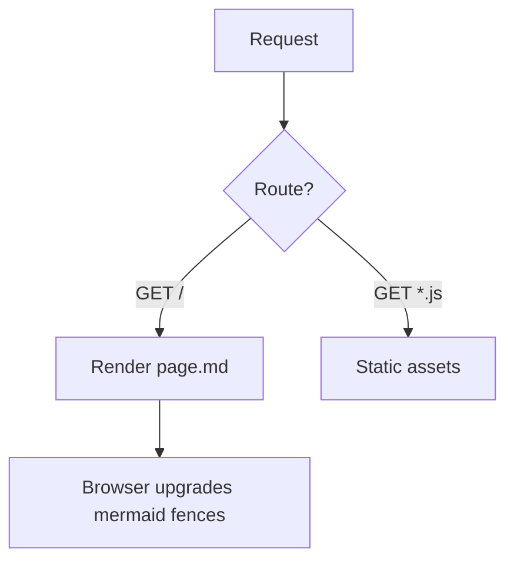
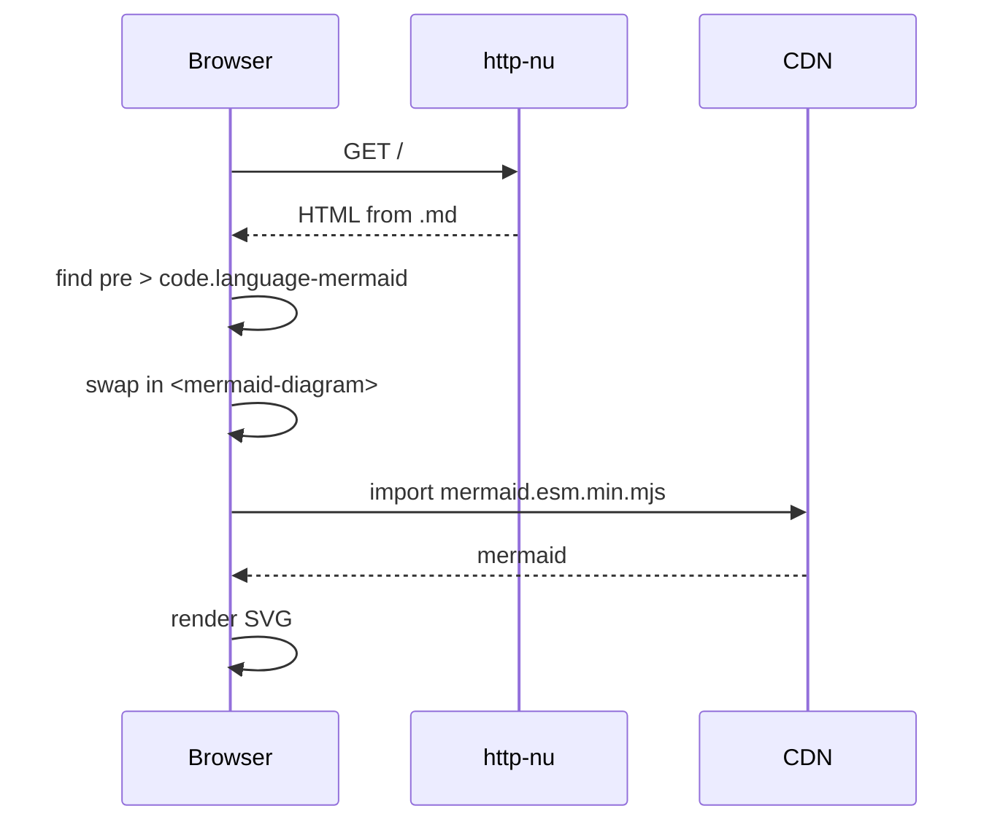

# Markdown with Mermaid

This page is a single markdown file rendered by http-nu's `.md` command.
Fenced code blocks tagged `mermaid` become live diagrams in the browser.
Every other fence is syntax highlighted on the server as usual.

## A flowchart



## A sequence diagram



## A regular code block

This one stays a `<pre>` and is highlighted by the server:

```nushell
def render [path: string]: nothing -> record {
  open --raw $path | decode utf-8 | .md
}
```

Inline HTML like <script>alert(1)</script> is escaped because the markdown
is passed to `.md` as a plain string, not as `{__html: ...}`.
